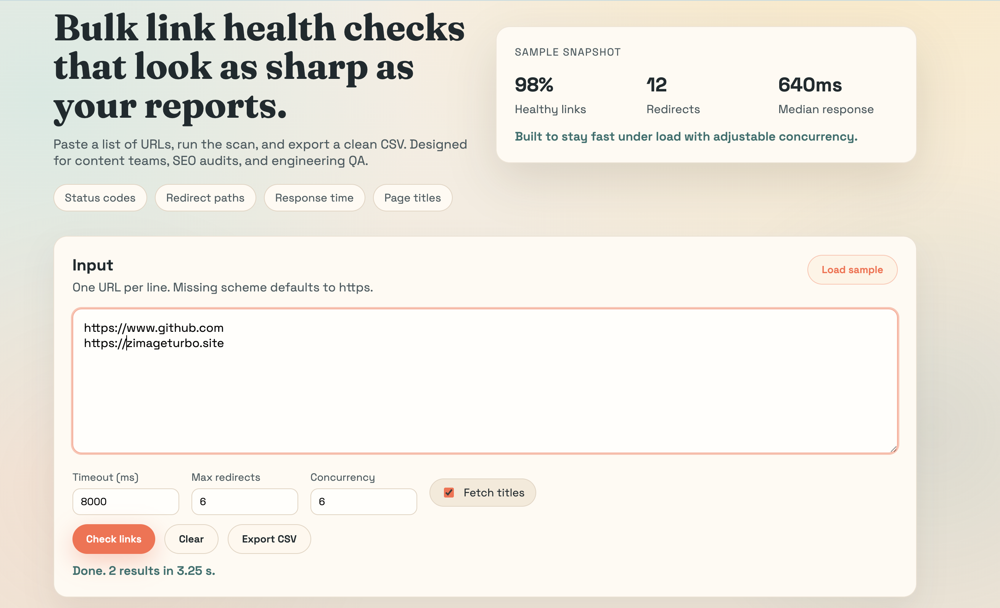
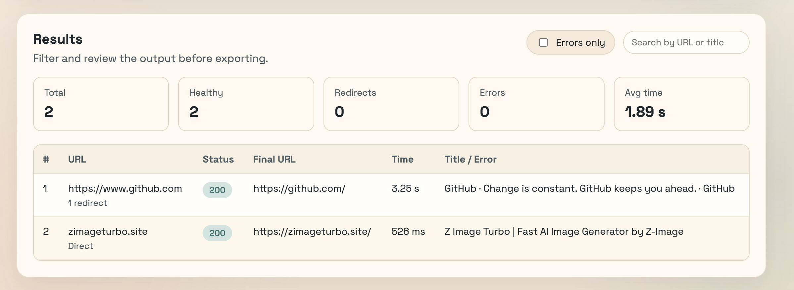

# Bulk Link Checker

A simple web UI to bulk check link health, response time, redirects, and titles.

## Features
- Bulk URL checks with adjustable timeout and concurrency
- Status codes, redirect counts, response time, and page titles
- CSV export for reporting and cleanup

## Run locally
1. Ensure Node.js 18+ is installed.
2. Start the server:

```bash
node server.js
```

3. Open `http://localhost:3000` in your browser.

## Notes
- Browsers cannot fetch arbitrary external URLs due to CORS, so checks are done server-side.
- Tune concurrency and timeout for large lists or slower networks.

## API
`POST /api/check`

Payload:

```json
{
  "urls": ["https://example.com"],
  "timeoutMs": 8000,
  "maxRedirects": 6,
  "concurrency": 6,
  "fetchTitle": true
}
```

Response:

```json
{
  "results": [
    {
      "inputUrl": "https://example.com",
      "normalizedUrl": "https://example.com/",
      "status": 200,
      "ok": true,
      "finalUrl": "https://example.com/",
      "redirects": ["https://example.com/"],
      "durationMs": 234,
      "title": "Example Domain",
      "contentType": "text/html; charset=UTF-8",
      "error": null
    }
  ],
  "durationMs": 1200
}
```




## Try it with these sites
You can test this checker with these two sites:
- https://zimageturbo.site/ - Z Image Turbo is a fast text-to-image generator delivering photorealistic results and multilingual text rendering.
- https://multisizer.app/ - MultiSizer resizes images in bulk for 60+ platforms so creators export Instagram, TikTok, Shopee, and Amazon sizes.
